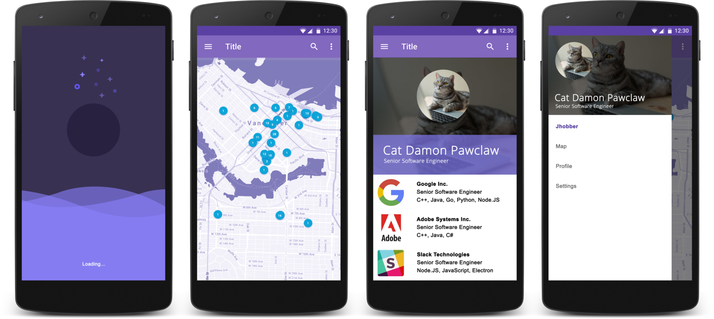

# Jhobber - Tinder For Job Applications

Android application to allow people to apply for jobs in the area.

The application was developed with zero previous knowledge of Android.

### Activity: Loading Screen

The entry point of the application will be a loading screen that includes the logo of the app in the center of the screen. Background color that — idealy — transitions among different pastel colors _(non-noticeable but present)_ and a small text indicating the processes that are currently running. This screen will be used during the startup of the app where the base resources need to be retrieved and loaded, including:

- Status of the remote web service
- List of featured job advertisements
- Potentially the user profile details
- Geo location data to curate the matches

## Activity: Map

Borrowing the idea from this project — https://whoishiring.io/ — this activity will display a map with all the potential matches for the user in the surrounding area. The initial search will take the current position of the user _(after having requested permission to geo-locate their phone)_ and filter the jobs in a 100km radius. Markers or little dots will denotate the position of the companies in the map.

**NOTE:** Some companies may offer remote jobs and/or relocation services which may affect the results as the geo-location of their offices will not correlate with the current position of the user. For this case, I suggest to find the name of the city where the user is located and position all the remote/relocation jobs in the epicenter of the city.

## Activity: Profile

This activity contains a brief summary of the user profile and a list of jobs that the user have liked and also a list of jobs that the user have matched with. These two lists will be separated into a tabbed panel for accessibility. The activity will be divided in two sections, the upper part contains a blurred background image that will potentially be the avatar associated to the LinkedIn profile, on top a circle with the non-blurred version of the avatar and below the user's first and last name. The lower panel contains a tabbed container with a list where each item contains an optional image with the logo of the company and in front the advertised job title.

## Activity: Settings

* Option to connect the user's LinkedIn account
* Option to configure the filters for the job search
* Option to upload a single PDF file with the resume
* Option to delete all the data related to the account
* Option to upload a custom background picture
* Option to upload a custom profile picture
