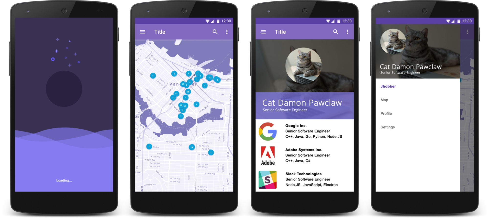

Android application to allow people to apply for jobs available in their city based on their LinkedIn profile.

**Note:** Both the mobile application and the corresponding [API service](https://github.com/cixtor/jhobberapi) _(written in Go - golang)_ were developed in approximately 48+ hours without previous knowledge of Android development as part of a hackaton in Vancouver.

## Project Architecture

```
         ┌────────────────────────────────────────────────────────────────────────────────┐
         │                                                        INTERNET                │
         │                                         ┌────────────────────────────────────┐ │
         │                                         │ ┌─────────────┐                    │ │
         │                       Android SDK       │ │    Cache    │                    │ │
         │                   ┌─────────────────┐   │ └──────┬──────┘                    │ │
         │                   │ ┌─────────────┐ │   │        │           ┌─────────────┐ │ │
         │                   │ │ Jhobber App │ │   │        ▼        ┌─▶│  LinkedIn   │ │ │
         │ ┌─────────────┐   │ └─────────────┘ │   │ ┌─────────────┐ │  └─────────────┘ │ │
         │ │ User Events ├──▶│        ▲        ├──▶│ │ API Service ├─┤                  │ │
         │ └─────────────┘   │ ┌──────┴──────┐ │   │ └─────────────┘ │  ┌─────────────┐ │ │
         │                   │ │ SharedPrefs │ │   │        ▲        └─▶│ Whoishiring │ │ │
         │                   │ └─────────────┘ │   │        │           └─────────────┘ │ │
         │                   └─────────────────┘   │ ┌──────┴──────┐                    │ │
         │                                         │ │  SQLite DB  │                    │ │
         │                                         │ └─────────────┘                    │ │
         │                                         └────────────────────────────────────┘ │
         └────────────────────────────────────────────────────────────────────────────────┘
```

**Note:** The source code for the API service written in Go (golang) is [available here](https://github.com/cixtor/jhobberapi).

---



---

## Adaptive Icons

Android 8.0 (API level 26) introduces adaptive launcher icons, which can display a variety of shapes across different device models. For example, an adaptive launcher icon can display a circular shape on one OEM device, and display a squircle on another device. Each device OEM provides a mask, which the system then uses to render all adaptive icons with the same shape. Adaptive launcher icons are also used in shortcuts, the Settings app, sharing dialogs, and the overview screen.

Ref: [Android Developers Documentation - Adaptive Icons](https://developer.android.com/guide/practices/ui_guidelines/icon_design_adaptive)

| Layers | Round Icon | Square Icon | Simulation |
|--------|------------|-------------|------------|
|  |  |  |  |

---


## Activities (aka. Android Screens)

The entry point of the app, a splash screen, shows a blue moon and an animation simulating the waves of the sea. While the application is loading, it connects with the remote API service and downloads a small set of data to populate the initial screens, including the map and the profile view.

The map is generated using the Google Maps SDK with center points on the location provided by the phone if the user provided access to the Geo Location Services. The markers are placed according to the information provided by another API service using [Elastic Search](https://en.wikipedia.org/wiki/Elasticsearch).

The profile view is populated using data obtained from LinkedIn using a proxy, the proxy in this case is simulating the interaction of a real user via the custom API service mentioned in the "Project Architecture" section. This allows the application to take advantage of features that are available in the web version of LinkedIn but unavailable in their public API.

One of the features available in the restricted API is the ability to submit your profile as a resume to the author of a job post via the "Easy Apply" button. Because the mobile application behaves exactly as a regular user, the restricted API responds to the HTTP requests the same way if you were browsing the web interface.

**Note:** Only a small percentage of the code is available, this is to prevent the 3rd-party API services to shutdown access to the restricted endpoints in their respective services.
